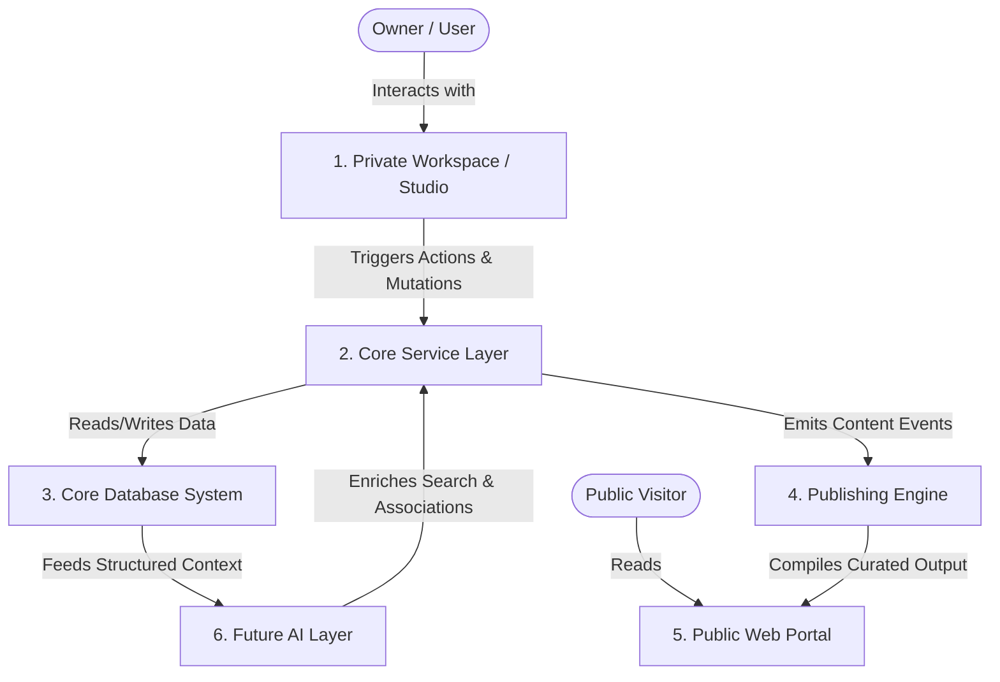

# System Context

- **Version**: 1.0
- **Status**: Approved
- **Owner**: CTO
- **Last Updated**: 2026-06-26

---

## Purpose

The System Context document maps the highest-level operational boundaries and integration pathways of the Rifqi platform. It describes how the core subsystems interact with each other and defines their primary operational responsibilities, providing a clear architectural guide for system coordination without specifying technologies.

## Context

The Rifqi Digital Headquarters operates as a coordinated multi-application ecosystem. The system must orchestrate private user operations (writing, project tracking), secure cloud database storage, static compilation pipelines for public visitors, and future intelligent reasoning modules. Documenting this structure ensures that developers understand how data and commands circulate through the platform.

## Subsystems and Ecosystem Diagram

## Subsystem Responsibilities

### 1. Private Workspace (Studio)
- **Role**: The primary interface for data entry, project tracking, and knowledge curation.
- **Responsibilities**:
  - Exposes secure, authenticated administrative interfaces to the owner.
  - Enables entity creation, updating, deletion, and relationship linkage.
  - Manages private drafting workflows and milestone management.
  - Validates user input before passing commands to the Service Layer.

### 2. Core Service Layer
- **Role**: The operational coordinator of business logic.
- **Responsibilities**:
  - Implements transactional domain rules (e.g. state transition requirements, taxonomy verification).
  - Mediates communication between interfaces (Workspace) and persistent storage (Database).
  - Coordinates multi-entity cascades (e.g. updating task completion recalculates project progress).
  - Dispatches domain events (e.g., "Article Published") to notify downstream consumers.

### 3. Core Database System
- **Role**: The persistent single source of truth for all entities and relationships.
- **Responsibilities**:
  - Guarantees transactional integrity (ACID properties) for entity mutations.
  - Houses the structured schemas representing concepts (Articles, Books, Learnings, Projects) and their metadata.
  - Stores relation vectors that compose the semantic knowledge graph.
  - Services low-latency search queries and analytics requests.

### 4. Publishing Engine
- **Role**: The transition pipeline from private content to public representation.
- **Responsibilities**:
  - Listens to publication events emitted by the Service Layer.
  - Filters out private drafts and restricted metadata, copying approved records to the public cache/site structures.
  - Executes static compilation processes, media compression, and formatting conversions.
  - Optimizes public assets for search crawlers (SEO) and web access speeds.

### 5. Public Web Portal
- **Role**: The presentation layer visible to the public.
- **Responsibilities**:
  - Displays compiled public entities (Articles, Projects, Learnings, Journey Events) using premium styling systems.
  - Provides instant read-only global search across published content.
  - Serves static pages optimized for accessibility, rendering performance, and metadata indexing.
  - Retains absolute separation from private data stores and administrative write channels.

### 6. Future AI Layer
- **Role**: The cognitive assistant and semantic enrichment engine.
- **Responsibilities**:
  - Automatically computes vector embeddings for newly created or modified entities.
  - Indexes context relationships to assist in global semantic searches.
  - Analyzes knowledge connectivity to recommend connections, book citations, or relevant goals during writing.
  - Interacts with the service layer to automate repetitive content indexing tasks.

---

## References
- [Masterplan](file:///e:/rifqi.id/docs/00-masterplan/MASTERPLAN.md)
- [Bounded Context](file:///e:/rifqi.id/docs/01-product/08-Bounded-Context.md)

## Decision Log
- **2026-06-26**: Initialization of the System Context diagram and subsystem roles by Senior Software Engineer. Status set to Approved.
