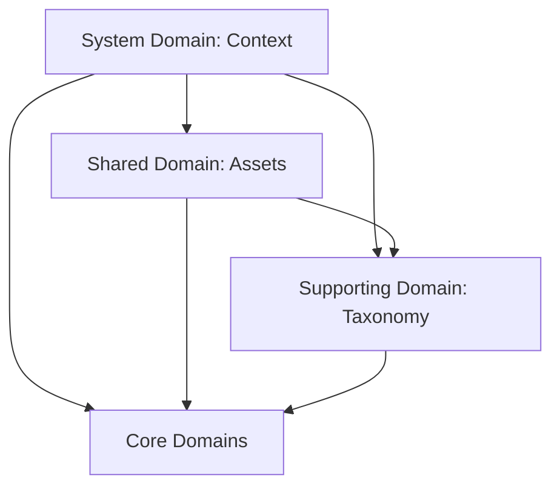

# Domain Model

- **Version**: 1.0
- **Status**: Approved
- **Owner**: CTO
- **Last Updated**: 2026-06-26

---

## Purpose

The Domain Model document categorizes all core conceptual entities into bounded subdomains. By classification based on Domain-Driven Design (DDD) principles—partitioning into Core, Supporting, Shared, and System domains—we enforce strict isolation of responsibilities and define how packages and services are layered.

## Context

A large codebase suffers when every module has unrestricted access to all entities. By grouping entities into domains, we can design clean, decoupled software modules. The boundaries established here prevent circular dependencies and guide developers on where to write business logic, database tables, and API routes.

---

## Domain Categorization Matrix

| Domain Category | Bounded Subdomain | Entities Included | Primary Responsibility |
|---|---|---|---|
| **Core Domains** | **Knowledge Graph** | Learning, Book, Idea, Research, Relationship | Manages semantic memory, study logs, research queries, and node associations. |
| | **Project Execution** | Project, Goal, Task (Task is owned by Project) | Tracks goals, coordinates project execution, and computes milestone progress. |
| | **Publishing & History** | Article, Journey Event, Collection | Manages draft promotion, media output, public catalogs, and historical timeline logs. |
| **Supporting Domains**| **Taxonomy** | Tag, Category, Resource | Enforces classifications, taxonomic tree paths, and links to external references. |
| **Shared Domains** | **Assets** | Media | Manages files, images, responsive sizes, compression, and deployment URLs. |
| **System Domains** | **Core Context** | Workspace, User, Permission | Dictates general configurations, authentication keys, and workspace constraints. |

---

## Bounded Subdomains Description

### 1. Knowledge Graph Domain (Core)
- **Role**: The brain of the Digital Headquarters. It focuses on conceptual memory and structural learning accumulation.
- **Entities**: Learning, Book, Idea, Research, Relationship.
- **Rules**:
  - Direct updates are authenticated and restricted to the Workspace (Studio).
  - All entities inside this domain can have semantic edges modeled by the Relationship entity.
  - Ideas graduate into Learnings or Projects when threshold metadata is completed.

### 2. Project Execution Domain (Core)
- **Role**: The execution coordinator. It tracks achievements, targets, and action logs.
- **Entities**: Project, Goal. (Sub-tasks are modeled as child execution components of Projects/Goals).
- **Rules**:
  - Recalculates goal and project completion ratios recursively when child components shift state.
  - Links directly to the Knowledge Graph to ensure tasks refer to active learning concepts.

### 3. Publishing & History Domain (Core)
- **Role**: The gatekeeper of presentation. It filters, compiles, and presents data to the public.
- **Entities**: Article, Journey Event, Collection.
- **Rules**:
  - Promotion of an entity to "Published" compiles a read-only representation.
  - Strips private metadata, author permission tokens, and private references.

### 4. Taxonomy Domain (Supporting)
- **Role**: Supports core domains by providing cataloging metadata and structured classification trees.
- **Entities**: Tag, Category, Resource.
- **Rules**:
  - Categories are strictly hierarchical (parent-child trees).
  - Resources manage page health (checking dead links) asynchronously.

### 5. Assets Domain (Shared)
- **Role**: Shared asset storage used universally across other domains.
- **Entities**: Media.
- **Rules**:
  - Media objects possess unique SHA-256 hashes to prevent duplicate file uploads.
  - Media must adapt its visibility dynamically based on the visibility of the entities referencing it.

### 6. Core Context Domain (System)
- **Role**: Manages security, workspaces, and system configurations.
- **Entities**: Workspace, User, Permission.
- **Rules**:
  - Enforces single-tenant isolation.
  - Permission matrices validate all write commands routed through the Workspace (Studio).

---

## Domain Relationships and Dependencies

The hierarchy of dependencies must flow in one direction:
- **System Domains** are imported globally and hold zero dependencies on other domains.
- **Shared Domains** (Assets) are imported by Core and Supporting domains but do not depend on them.
- **Supporting Domains** (Taxonomy) depend on Shared and System domains, but not on Core domains.
- **Core Domains** (Knowledge, Projects, Publishing) depend on Taxonomy, Assets, and System domains.

---

## References
- [Entity Catalog](file:///e:/rifqi.id/docs/02-architecture/02-Entity-Catalog.md)
- [Bounded Context](file:///e:/rifqi.id/docs/01-product/08-Bounded-Context.md)

## Decision Log
- **2026-06-26**: Formulation of core subdomains and dependency guidelines by Senior Software Engineer. Status set to Approved.
