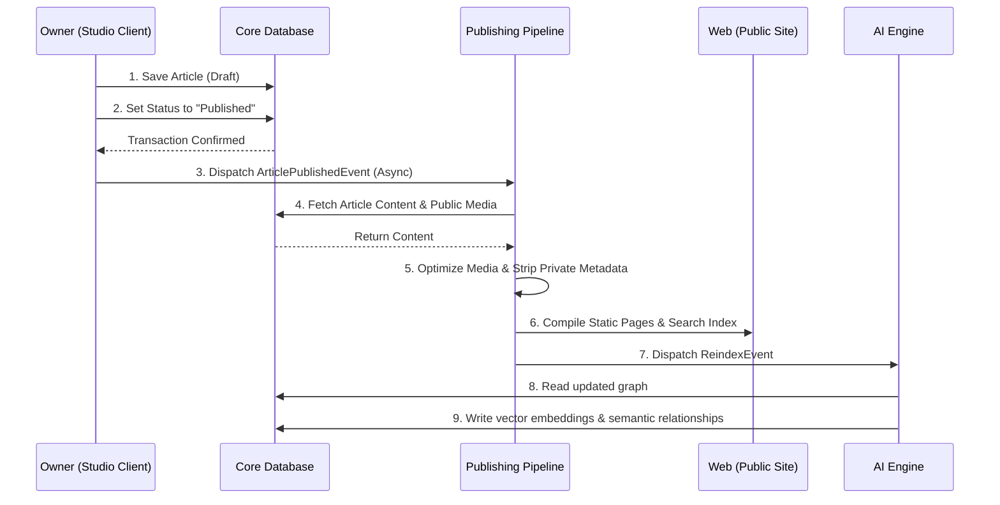

# Bounded Contexts

- **Version**: 1.0
- **Status**: Approved
- **Owner**: CTO
- **Last Updated**: 2026-06-26

---

## Purpose

The Bounded Contexts document defines the logical boundaries dividing the subsystems of the Rifqi platform. It details ownership parameters, functional responsibilities, and communication patterns between contexts, serving as the blueprint for package interfaces and API boundaries.

## Context

To avoid architectural decay in a monorepo, boundaries must be clear and strictly enforced. If services in the public Web application can write directly to the database or modify internal workspace states, security is compromised and code becomes tangled. This document defines the borders of the workspace, public presentation, and downstream pipelines.

---

## Bounded Context Matrix

| Bounded Context | System Boundary | Primary Owner | Operational Responsibility |
|---|---|---|---|
| **Studio Workspace (Studio)** | Administrative client and application layer. | User (Owner) | Administrative management, data curation, project coordination, and database writes. |
| **System Database Core** | Persistence storage layer. | Workspace (Studio) | Houses the authoritative data schemas and enforces structural relational constraints. |
| **Public Presentation (Web)** | Compiled public portal. | Public Visitors | Serves fast, read-only static pages and manages guest search index requests. |
| **Publishing Pipeline** | Asynchronous service layer. | Core System | Transforms private workspace data, processes media assets, and compiles public sites. |
| **Intelligence Engine (AI)** | Asynchronous analytical context. | Core System | Generates vector embeddings, indexes semantics, and computes connections. |

---

## Context Descriptions and Boundaries

### 1. Studio Workspace (Studio Context)
- **Ownership**: The authenticated owner holds exclusive write rights.
- **Responsibilities**:
  - Exposes administrative routes, editing UI, task boards, and curation panels.
  - Generates events when entities change (e.g. "Learning Curated").
  - Prevents public read access to private draft states.
- **Borders**: Communicates with the System Database via transactional services. It cannot write directly to the compiled Web directories; publishing must be routed through the Publishing Pipeline.

### 2. System Database Core
- **Ownership**: Owned exclusively by the Studio Workspace application layer.
- **Responsibilities**:
  - Stores all entities, taxonomies, relationships, and settings.
  - Enforces database constraints and triggers transactional audits.
- **Borders**: The Web presentation context has absolutely no direct write connection to this database. It may only query a read-only replica or receive compiled static data.

### 3. Public Presentation (Web Context)
- **Ownership**: Accessible globally to all web clients.
- **Responsibilities**:
  - Displays high-performance, responsive pages representing public Articles, Projects, and Learnings.
  - Services local page search using compiled public search indexes.
- **Borders**: Read-only. The Web context holds no reference to write services, database connection keys (write-enabled), or the administrative Studio application logic.

### 4. Publishing Pipeline
- **Ownership**: Managed by system service routines triggered by status changes.
- **Responsibilities**:
  - Listens for "Publish" events from the Studio context.
  - Pulls public records from the database, strips private context metadata, optimizes images, and builds the Web application's static pages.
- **Borders**: Reads from the primary database, writes to public static directories, and triggers page revalidation.

### 5. Intelligence Engine (AI Context)
- **Ownership**: Runs in the background as an analytical micro-context.
- **Responsibilities**:
  - Generates vector databases, semantic caches, and connection recommendations.
- **Borders**: Reads entity data, publishes recommendations, and writes strictly to the specialized search indexes or a dedicated semantic database tables.

---

## Context Communication Patterns

1. **Studio -> Database**: Synchronous, transactional read/write operations via the database package layer.
2. **Studio -> Publishing Pipeline**: Asynchronous communication triggered by Domain Events (e.g., `ArticlePublishedEvent`).
3. **Publishing Pipeline -> Web**: Unidirectional, file-based static output generation or CDN cache invalidation.
4. **Studio/Database -> Intelligence Engine**: Asynchronous subscription to data change feeds, returning enrichment tags or recommendation indices.
5. **Web -> Studio**: Strictly prohibited. Any communication from the Web (such as contact inputs or future integration hooks) must be routed through public endpoints that write to an isolated queue, never directly to the primary workspace database.

---

## References
- [System Context](file:///e:/rifqi.id/docs/02-architecture/01-System-Context.md)
- [Domain Model](file:///e:/rifqi.id/docs/02-architecture/03-Domain-Model.md)

## Decision Log
- **2026-06-26**: Definition of bounded context boundaries, security borders, and communication sequences by Senior Software Engineer. Status set to Approved.
