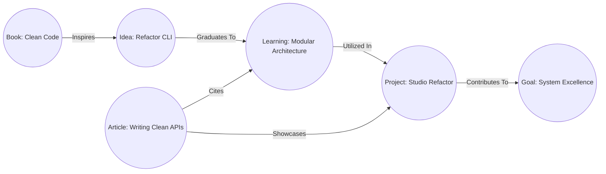

# Knowledge Graph

- **Version**: 1.0
- **Status**: Approved
- **Owner**: CTO
- **Last Updated**: 2026-06-26

---

## Purpose

The Knowledge Graph document outlines the conceptual structure of the Rifqi platform's semantic data layer. It details the nodes, edges, relationships, and traversal logic that turn isolated database records into an interconnected second brain, facilitating advanced search and future AI integrations.

## Context

Traditional databases organize files in rigid, isolated tables or folder paths. This creates information siloing, where notes, projects, and books cannot reference each other dynamically. Modeling data as a Knowledge Graph allows the platform to mirror the associative patterns of human memory, enabling discovery, deep querying, and personalized AI context formulation.

---

## Graph Components

The knowledge graph is formed by two primary concepts: **Nodes** and **Edges**.

### 1. Nodes (Vertices)
Nodes represent individual, uniquely identifiable conceptual entities. Every core entity defined in the [Entity Catalog](file:///e:/rifqi.id/docs/02-architecture/02-Entity-Catalog.md) acts as a Node.
- **Node Identifier**: Every Node has an immutable global key (e.g. UUID) and a slug.
- **Node Attributes**: Metadata fields detailing the node's type, lifecycle status, timestamps, and body content.
- **Node Classification**: Nodes are typed (e.g. `Type: Learning`, `Type: Project`).

### 2. Edges (Links)
Edges represent semantic connections between Nodes. Edges are modeled programmatically using the `Relationship` entity.
- **Directionality**: All semantic Edges are directional, having a explicit `Source Node` and a `Target Node`. The system automatically computes reverse directions to support bidirectional traversal.
- **Weight**: Edges possess optional numerical weights representing relationship strength (e.g. a book that is heavily cited has a higher link weight than a casual reference).
- **Semantics**: Every Edge must declare an explicit relationship type.

---

## Core Semantic Relationship Types

Edges are categorized into typed semantic associations:
- **Cites / References**: Links a node to a source book, learning note, or article (e.g., `Article A` *references* `Learning B`).
- **Inspires / Generates**: Connects a source node to a derivative insight (e.g., `Book C` *inspires* `Idea D`).
- **Contributes To**: Maps a project or learning node to an overarching strategic goal (e.g., `Project E` *contributes to* `Goal F`).
- **Utilizes**: Declares stack dependencies (e.g., `Project G` *utilizes* `Technology H`).
- **Belongs To / Categorizes**: Categorization linkage (e.g., `Learning I` *belongs to* `Category J`).

---

## Graph Traversal Logic

Traversal is the act of navigating the graph across edges. The platform supports the following query pathways:
- **Direct Adjacency**: Fetching all nodes directly connected to a target node (e.g., finding all technologies utilized by a specific project).
- **Multi-Hop Traversal**: Querying related nodes across multiple edges (e.g., finding all Books that inspired Learnings that were utilized in completed Projects).
- **Backlink Aggregation**: Retrieving all incoming edges pointing to a target node, allowing the system to show where an article or book is cited across the entire workspace.

---

## Search and Retrieval Implications

Designing the data as a Knowledge Graph impacts search and discovery:
- **Semantic Relevance Ranking**: Search results are ranked not just by keyword density, but by link density. A node with many incoming references (high in-degree) is considered more authoritative and ranks higher in results.
- **Contextual Discovery**: When a user searches for a specific topic, the search engine retrieves the matching node and automatically surfaces neighboring nodes within a 2-hop radius, revealing connected books, projects, and notes.
- **Orphan Analysis**: The traversal engine audits the graph to detect isolated nodes (nodes with 0 edges), prompting the user to connect them to preserve knowledge integrity.

---

## Future AI Integration

The Knowledge Graph acts as the context provider for the future AI Layer:
- **Graph-Augmented Generation (Retrieval-Augmented Generation - RAG)**: When an AI model is queried, the system traverses the graph around the user's active node to retrieve a highly relevant context packet, ensuring the AI understands historical projects, readings, and related concepts.
- **Relationship Inference**: AI scripts can parse the unstructured body text of nodes to automatically suggest new Edges (e.g., "This note appears to reference topics discussed in Book X. Create link?").
- **Automatic Summary Trees**: AI can analyze a cluster of closely connected nodes to synthesize comprehensive summary notes for specific research domains.

---

## References
- [Entity Catalog](file:///e:/rifqi.id/docs/02-architecture/02-Entity-Catalog.md)
- [Relationship Matrix](file:///e:/rifqi.id/docs/02-architecture/05-Relationship-Matrix.md)

## Decision Log
- **2026-06-26**: Modeling of conceptual node/edge behaviors and RAG context guidelines by Senior Software Engineer. Status set to Approved.
