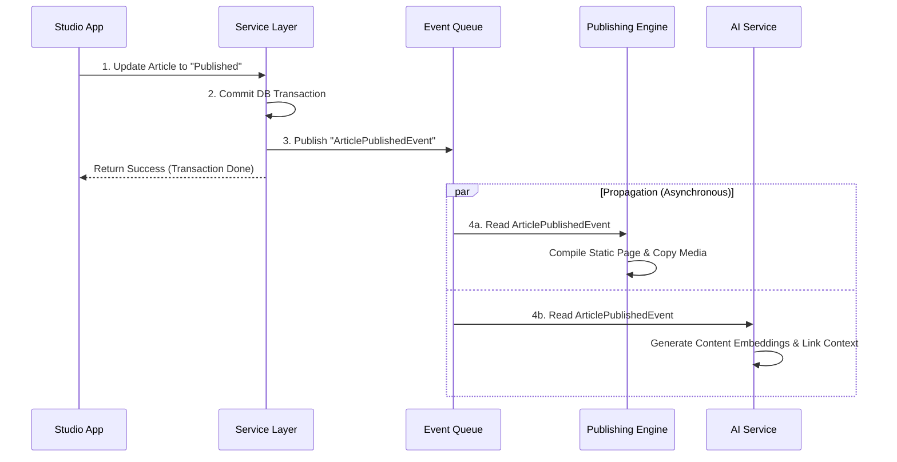

# Event Flow

- **Version**: 1.0
- **Status**: Approved
- **Owner**: CTO
- **Last Updated**: 2026-06-26

---

## Purpose

The Event Flow document maps the core business events of the Rifqi platform. It describes how events are triggered, their structures, and how they propagate across subsystems to coordinate data validation, semantic indexing, static site publishing, and future AI enrichment asynchronously.

## Context

To maintain separation of concerns and avoid coupling core services, the platform uses event-driven communication. For example, when an Article is published, the Article Service should not directly trigger public web compilation or vector embedding generation. Instead, it emits an event, allowing independent subscribers to respond asynchronously.

---

## Key Domain Events

### 1. ProjectCreatedEvent
- **Trigger**: A new Project entity is saved in the Studio workspace database.
- **Payload**: Project ID, creator User ID, linked Goal IDs, timestamp.
- **Propagation Flow**:
  - *Goal Service* listens to recalculate active project count under the linked Goal.
  - *Search Indexer* listens to add the project metadata to the workspace search index.
  - *AI Engine* listens to index the project context for future suggestions.

### 2. ArticlePublishedEvent
- **Trigger**: An Article's state transitions from `Review` to `Published` in the Studio.
- **Payload**: Article ID, slug, category, publication date, author user ID, timestamp.
- **Propagation Flow**:
  - *Publishing Engine* intercepts the event to strip private metadata, copy media files, compile markdown, and trigger the static site build.
  - *Public Web Search Indexer* adds the article's text to the public search catalog.
  - *System Log* records the event on the owner's publishing ledger.

### 3. GoalCompletedEvent
- **Trigger**: A Goal's state transitions from `Active` to `Achieved`.
- **Payload**: Goal ID, completion timestamp, success metric log, related project list.
- **Propagation Flow**:
  - *Journey Event Service* auto-generates a draft Journey Event commemorating the milestone achievement.
  - *Project Service* sets any remaining active tasks linked strictly to this Goal to a review state.

### 4. MediaUploadedEvent
- **Trigger**: A binary file upload completes, saving a raw Media database record.
- **Payload**: Media ID, temp file path, file size, mime type, hash signature, upload timestamp.
- **Propagation Flow**:
  - *Media Processing Pipeline* intercepts the event, running asynchronous image compression, WebP conversion, and generating responsive size files.
  - *Database Service* updates the Media entity lifecycle state from `Raw` to `Active` once processing completes.

### 5. LearningCapturedEvent
- **Trigger**: A Learning note graduates from `Raw Draft` to `Curated` status.
- **Payload**: Learning ID, source reference (Book ID/Resource URL), linked Technology slugs, timestamp.
- **Propagation Flow**:
  - *Knowledge Graph Service* computes and updates relationship tables for direct and bidirectional links.
  - *AI Embedding Service* generates vector embeddings of the note content and writes it to the semantic context database.
  - *Workspace Search Service* indexes the content for instant suggestion boards.

---

## Event Propagation Architecture

The event flow operates on a publish-subscribe model:
1. **Event Dispatching**: The Workspace application layer handles mutations (write transactions). Once a transaction commits successfully, the Core Service Layer dispatches the corresponding domain event.
2. **Event Queue**: Events are placed in a lightweight transactional event log/queue.
3. **Synchronous Handlers**: Crucial integrity checks are executed synchronously before confirming the transaction to the client (e.g. validating user permissions).
4. **Asynchronous Handlers**: Non-blocking workflows (AI vector embedding, media compression, static page compilation, external notification alerts) are executed asynchronously by downstream subscriber services.

---

## References
- [System Context](file:///e:/rifqi.id/docs/02-architecture/01-System-Context.md)
- [Lifecycle Model](file:///e:/rifqi.id/docs/02-architecture/07-Lifecycle-Model.md)

## Decision Log
- **2026-06-26**: Designing the domain event matrix and propagation sequences by Senior Software Engineer. Status set to Approved.
