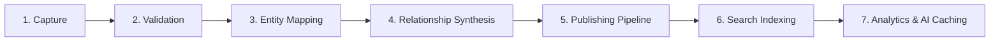

# Data Flow

- **Version**: 1.0
- **Status**: Approved
- **Owner**: CTO
- **Last Updated**: 2026-06-26

---

## Purpose

The Data Flow document describes the lifecycle and movement of data within the Rifqi platform. It traces information from initial ingestion through validation, storage, relationship modeling, compilation, indexation, and search, establishing the data processing pipeline.

## Context

Understanding how data traverses subsystems ensures that state remains consistent. Because Rifqi processes a wide variety of information (from brief, raw ideas to structured articles, books, and tasks), mapping data flows prevents leakage, structural drift, and data validation corruption.

---

## The Information Processing Pipeline

Data traverses seven distinct stages as it progresses through the Digital Headquarters.

### Stage 1: Capture
- **Activity**: Ingestion of raw notes, text snippets, files, links, or tasks from user interface clients.
- **Data State**: Unstructured raw text, file binaries, URL strings, and basic title variables.
- **Constraints**: Focuses on lowest-friction ingestion (e.g. quick-capture forms). Zero formatting assumptions.

### Stage 2: Validation
- **Activity**: Evaluating incoming data blocks against structural rules and schema rules.
- **Data State**: Structurally checked JSON or Markdown frontmatter variables.
- **Constraints**: Rejects incomplete schema structures, unauthorized permission access keys, and malformed entity slugs.

### Stage 3: Entity Mapping
- **Activity**: Storing validated data in the system database mapped strictly to the specified entity types (e.g. Book, Project, Learning).
- **Data State**: Transactional database records or persistent structured files.
- **Constraints**: Assigns immutable entity identifiers (UUIDs), set initial lifecycle state (e.g., `Draft`), and registers timestamp metadata.

### Stage 4: Relationship Synthesis
- **Activity**: Mapping connection paths between the newly mapped entity and existing system nodes.
- **Data State**: Active relational edges registered in the Database Core.
- **Constraints**: Verifies relationship type compatibility constraints (e.g., a Book can *inspire* an Idea, but an Idea cannot *contain* a Book). Builds bidirectional links.

### Stage 5: Publishing Pipeline
- **Activity**: Activating compile routines to transition public-facing entities to read-only caches.
- **Data State**: Clean, optimized HTML page segments, static JSON feeds, and compressed media files.
- **Constraints**: Strips private metadata attributes, resolves internal workspace slugs to public web endpoints, and verifies page compilation formats.

### Stage 6: Search Indexing
- **Activity**: Forwarding content strings and relationship vectors to index engines.
- **Data State**: Search index records stored in specialized database structures.
- **Constraints**: Updates both the private workspace global index and the public web read-only search index.

### Stage 7: Analytics & AI Caching
- **Activity**: Generating vector embeddings and database analytics logs.
- **Data State**: Multi-dimensional floating-point vectors and graph connectivity data tables.
- **Constraints**: Recalculates metrics (such as the Connected Knowledge Growth metric) and caches semantic recommendations for retrieval.

---

## References
- [Bounded Contexts](file:///e:/rifqi.id/docs/02-architecture/04-Bounded-Contexts.md)
- [Event Flow](file:///e:/rifqi.id/docs/02-architecture/08-Event-Flow.md)

## Decision Log
- **2026-06-26**: Design of the seven-stage data processing pipeline by Senior Software Engineer. Status set to Approved.
